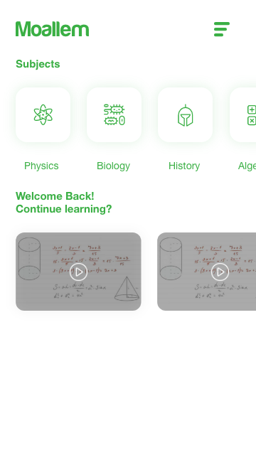

# Moallem-Challenge Android Solution

[(https://kotlinlang.org)

[(https://github.com/Msoliman512/Moallem-Challenge/blob/master/LICENSE)

This is a solution to the mobile code challenge by 'Moallem' which is an Egyption startup that operates in Egypt.

## About this project
This task is about creating a new one activity application similar to this desired layout with its all functions properly working.

